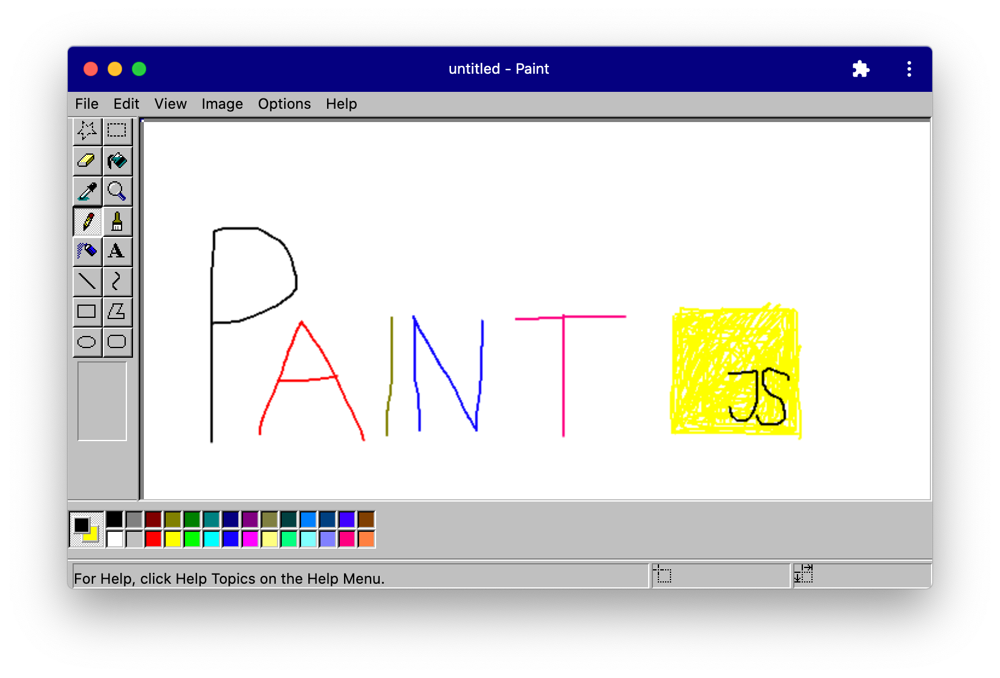

# Paint: An open-source, Web Components-based remake of MS Paint using modern web capabilities

Paint is back—right in your browser! Try it on [paint.js.org](https://paint.js.org).

This project aims to demonstrate modern web capabilities and Web Component-based application architectures on the example of a productivity app dinosaur: Paint.
All offline-capable and installable, just as [Progressive Web Apps](https://web.dev/progressive-web-apps/) should be.

## PLEASE NOTE

This project is in an early state. Not all tools and actions are implemented right now. Your help and feedback are wanted!

## Modern Web Technology

This project demonstrates the use of:

- [Web Components](https://www.webcomponents.org/introduction), the native component model of the web (via [lit-element](https://lit-element.polymer-project.org/))
- [Service Workers](https://developers.google.com/web/fundamentals/primers/service-workers) for offline capability (via [Workbox](https://developers.google.com/web/tools/workbox))
- [Web App Manifest](https://github.com/w3c/manifest) for installability
- [Native File System API](https://web.dev/native-file-system/) for file system access (via [browser-nativefs](https://github.com/GoogleChromeLabs/browser-nativefs))
- [Async Clipboard API](https://web.dev/image-support-for-async-clipboard/) for clipboard access
- [Snowpack](https://www.snowpack.dev/), a bundle-free, O(1) build system

## Goals

- This implementation tries to stick as closely as possible to the original Paint for Windows 95—not more, but also not less. Improvements to user experience (e.g., larger undo stack) are welcome, but features beyond the original scope should be avoided. You might want to check out [Felix Rieseberg’s windows95 to run the original Paint](https://github.com/felixrieseberg/windows95).
- This implementation should stay smaller (= transferred bytes) than Paint’s executable size of 340K.
- Everything must be achieved with native web technology only, so no Cordova or Electron builds. Features that are not exposed to the web must be disabled in the menu.
- Where modern web APIs are used, they should be [progressively enhanced](https://web.dev/progressively-enhance-your-pwa/).

## Setup

1. Clone this repository
2. Run `npm i`
3. Run `npm start`
4. Done!

Whenever you introduce changes to public files, run `npm run generate-sw` to update the cache manifest of the service worker.

## Wait, I’ve seen this before

You’re right! The awesome [JSPaint](https://jspaint.app/) ([GitHub](https://github.com/1j01/jspaint)) has been around for a long time and is, by far, more complete.
In contrast to JSPaint, this project is licensed under an OSS license, so you can fork this repository, use it in your demos, and contribute.
Please do not copy over code from JSPaint to this repository.

## License

This project is provided for educational purposes only.
It is not affiliated with and has not been approved by Microsoft.
